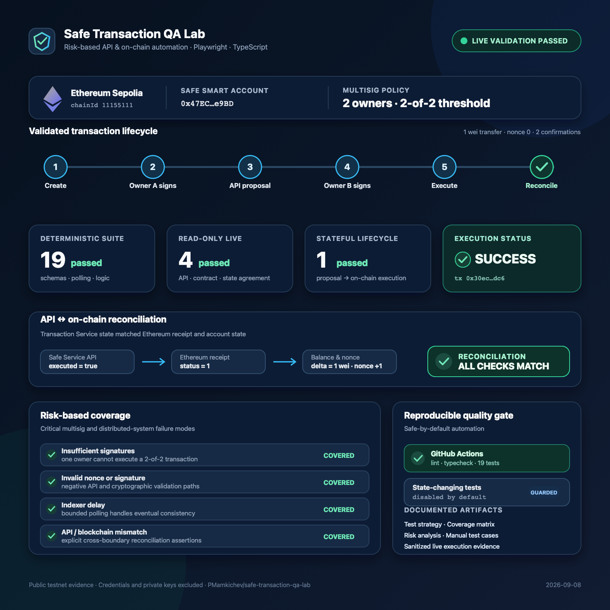

# Safe Transaction QA Lab

[](https://ethereum.org/developers/docs/networks/)
[](https://playwright.dev/)
[](https://www.typescriptlang.org/)

Risk-based API and on-chain test automation for a Safe Smart Account multisignature
transaction flow.

> Project status: MVP complete and validated against a dedicated `2-of-2` Safe on Ethereum
> Sepolia. The public execution evidence is documented separately from local credentials.

<p align="center">
  
</p>

## Why this project exists

A Web3 transaction can look successful in a user interface while an API, indexer, or
blockchain node reports a different state. This project demonstrates how to test the complete
flow and reconcile the result across system boundaries.

The target scenario is a `2-of-2` Safe on Ethereum Sepolia:

```text
Create transaction -> Owner A signs -> Propose via API -> Pending
                  -> Owner B signs -> Execute on-chain -> Reconcile
```

## MVP scope

- Validate Safe configuration through the Safe Transaction Service API.
- Verify owners and threshold directly on-chain.
- Compare API and blockchain state.
- Propose, confirm, and execute one minimal-value Sepolia transaction.
- Cover selected invalid input, signature, nonce, and indexing-delay risks.
- Run deterministic quality checks on pull requests.
- Run the state-changing Sepolia scenario only when explicitly enabled.

## Out of scope for v1.0

- Mainnet or real-value transactions
- Smart contract security auditing
- Multi-chain coverage
- Full Safe web or mobile UI automation
- Load testing and production monitoring

## Quick start

```bash
pnpm install
pnpm check
cp .env.example .env
pnpm env:check
pnpm test:read-only
STATEFUL_TESTS_ENABLED=true pnpm test:sepolia
```

`pnpm check` runs 19 deterministic tests and does not require credentials or network access.
Live tests skip safely when their environment is not configured.

## Live environment

Create a Safe API key and a dedicated Ethereum Sepolia test environment. To generate owner keys
without displaying them in terminal output, run:

```bash
pnpm setup:accounts
```

This creates `.env` with file mode `0600` and refuses to overwrite an existing file. It prints
only public addresses. Fund Owner A with enough Sepolia ETH for deployment and execution gas,
then use the guarded deployment commands:

```bash
pnpm setup:safe:predict
pnpm setup:safe:deploy
```

The first command only predicts the `2-of-2` Safe address. The second command explicitly
broadcasts its deployment. Copy the resulting address to `SAFE_ADDRESS`, add the Safe API key,
and fund the Safe with at least 1 wei.

For a reproducible funding step, run `pnpm setup:safe:fund:dry-run` and then
`pnpm setup:safe:fund`; the latter transfers `0.001` Sepolia ETH from Owner A to the deployed
Safe.

Run `pnpm env:check:stateful` before the first state-changing test. The command reports only the
mode, Safe address, and RPC origin; it never prints credentials.

## Test architecture

- **Unit:** configuration, runtime schemas, polling, and reconciliation logic.
- **Read-only:** Safe service health, deployed contract, unknown Safe, and API/on-chain agreement.
- **Stateful:** one serial `2-of-2` proposal, confirmation, execution, receipt, and balance check.

Playwright produces list, HTML, and JSON reports. Successful stateful runs attach a sanitized
transaction evidence file containing public addresses and transaction hashes.

## Safety rules

- Use dedicated test-only accounts and Sepolia ETH.
- Never reuse a mainnet account, seed phrase, or employer-owned credential.
- Keep `.env` local; only `.env.example` belongs in Git.
- Stateful tests are disabled by default.
- CI secrets must be stored in GitHub Actions secrets.

## Documentation

- [Test strategy](docs/test-strategy.md)
- [Coverage matrix](docs/coverage-matrix.md)
- [Architecture](docs/architecture.md)
- [Manual test cases](docs/test-cases.md)
- [Risk analysis](docs/risk-analysis.md)
- [AI-assisted workflow](docs/ai-assisted-workflow.md)
- [Live Sepolia setup](docs/live-setup.md)
- [Live test evidence](docs/test-evidence.md)
- [Bug report policy](docs/bug-reports/README.md)

## License

[MIT](LICENSE)
