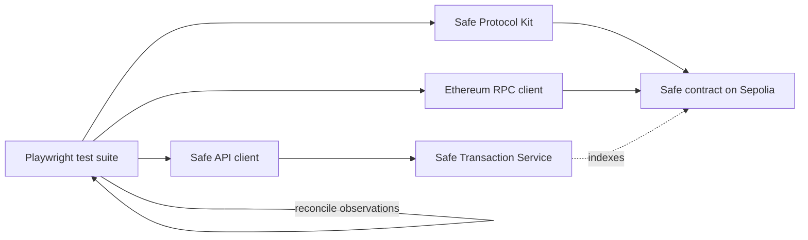

# Architecture

## Design principles

- Separate transport clients from business assertions.
- Parse untrusted configuration and critical API responses at runtime.
- Compare independent observations instead of trusting one API response.
- Keep read-only and state-changing tests in different Playwright projects.
- Keep secrets outside the repository and disable stateful actions by default.
